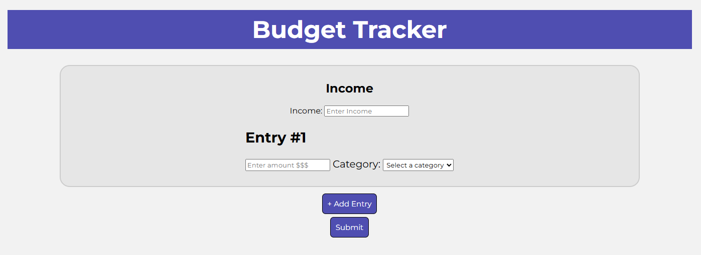

# 💰 Budget Tracker Visualizer  

A simple and interactive web app to help track your finances. Enter your income, add expenses with categories, and instantly see your spending breakdown with graphs.  

## ✨ Features  
- 📝 Add income and track total balance  
- 💵 Log expenses with custom categories  
- 📊 View a pie chart of expenses by category  
- 📈 Compare income vs expenses with a bar chart  
- 🎨 Clean and responsive design  

## 🛠️ Built With  
- HTML  
- CSS  
- JavaScript  
- Chart.js (for graphs)  

## 📷 Preview  

---
Made with ❤️ to make budgeting easier.
